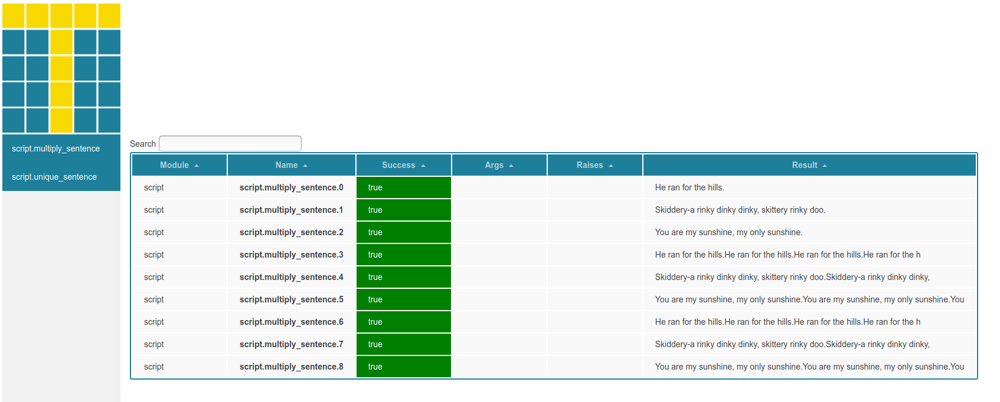
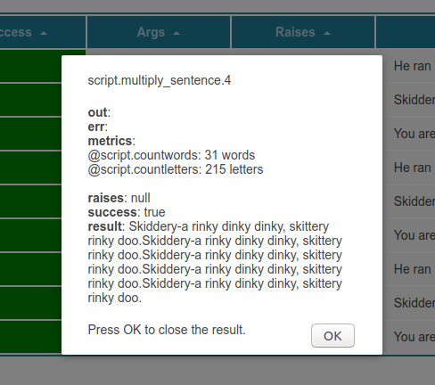

# Results Interface

This is an example that starts with the [custom-decorator](../custom-decorator)
example and shows how to generate an interactive interface with results. We've
added an additional function and metric decorator to produce a more interesting
result:

```bash
$ gridtest test
[12/12] |===================================| 100.0% 
Name                           Status                         Summary                       
________________________________________________________________________________________________________________________
script.multiply_sentence.0     success                                                      
script.multiply_sentence.1     success                                                      
script.multiply_sentence.2     success                                                      
script.multiply_sentence.3     success                                                      
script.multiply_sentence.4     success                                                      
script.multiply_sentence.5     success                                                      
script.multiply_sentence.6     success                                                      
script.multiply_sentence.7     success                                                      
script.multiply_sentence.8     success                                                      
script.unique_sentence.0       success                                                      
script.unique_sentence.1       success                                                      
script.unique_sentence.2       success                                                      

________________________________________________________________________________________________________________________
script.multiply_sentence.0     @script.countwords             5 words                       
script.multiply_sentence.0     @script.countletters           17 letters                    
script.multiply_sentence.1     @script.countwords             7 words                       
script.multiply_sentence.1     @script.countletters           43 letters                    
script.multiply_sentence.2     @script.countwords             7 words                       
script.multiply_sentence.2     @script.countletters           32 letters                    
script.multiply_sentence.3     @script.countwords             21 words                      
script.multiply_sentence.3     @script.countletters           85 letters                    
script.multiply_sentence.4     @script.countwords             31 words                      
script.multiply_sentence.4     @script.countletters           215 letters                   
script.multiply_sentence.5     @script.countwords             31 words                      
script.multiply_sentence.5     @script.countletters           160 letters                   
script.multiply_sentence.6     @script.countwords             41 words                      
script.multiply_sentence.6     @script.countletters           170 letters                   
script.multiply_sentence.7     @script.countwords             61 words                      
script.multiply_sentence.7     @script.countletters           430 letters                   
script.multiply_sentence.8     @script.countwords             61 words                      
script.multiply_sentence.8     @script.countletters           320 letters                   
script.unique_sentence.0       @script.countwords             5 words                       
script.unique_sentence.0       @script.countletters           17 letters                    
script.unique_sentence.1       @script.countwords             6 words                       
script.unique_sentence.1       @script.countletters           38 letters                    
script.unique_sentence.2       @script.countwords             6 words                       
script.unique_sentence.2       @script.countletters           30 letters                    

12/12 tests passed
```

## Run Tests

Generating the interface is simple! Remember that if we wanted to save the raw
results, we could add `--save` with a filename:

```bash
$ gridtest test --save results.json
```

You can do the same for the interface, but instead provide the --save-web
flag. If you don't provide an argument to this flag, it will generate
a folder for you in `/tmp` with files that can be added to a web server.
If you do provide a folder path, the same folder will be renamed
to be there (so make sure it doesn't exist). The following command
will save pages to [web](web) in the present working directory.

```bash
$ gridtest test --save-web web/
```

You should then be able to put these static files on GitHub pages, or just cd
into the folder and run a webserver:

```bash
python -m http.server 9999
```

And see the content at [http://localhost:9999](http://localhost:9999). This
is a fairly simple results template that lets you select functions in the left
columns, and then see specific tests in the right table



and mouse over the test name to see the output, error, and metrics recorded.


